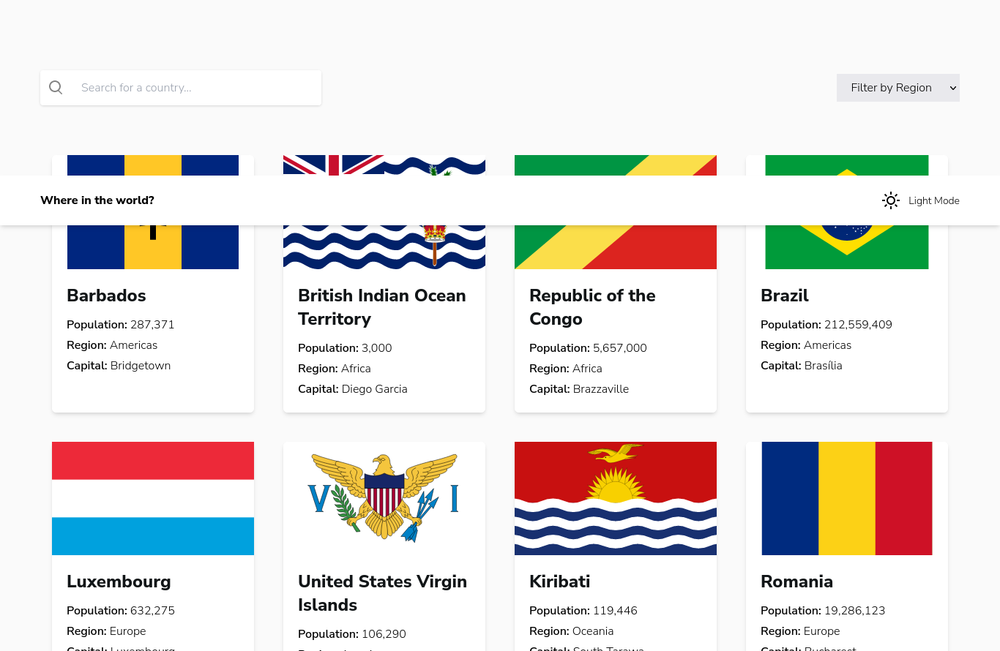

# Frontend Mentor - REST Countries API with color theme switcher solution

This is a solution to the [REST Countries API with color theme switcher challenge on Frontend Mentor](https://www.frontendmentor.io/challenges/rest-countries-api-with-color-theme-switcher-5cacc469fec04111f7b848ca).

## Table of contents

- [Overview](#overview)
  - [The challenge](#the-challenge)
  - [Screenshot](#screenshot)
  - [Links](#links)
- [My process](#my-process)
  - [Built with](#built-with)
- [Author](#author)

## Overview

### The challenge

Users should be able to:

- See all countries from the API on the homepage
- Search for a country using an `input` field
- Filter countries by region
- Click on a country to see more detailed information on a separate page
- Click through to the border countries on the detail page
- Toggle the color scheme between light and dark mode _(optional)_

### Screenshot

### Links

- Solution URL: [solution URL](https://github.com/benjithorpe/FEM-countries-data)
- Live Site URL: [live site URL](https://fem-countries-data.netlify.app/)

## My process

### Built with

- Semantic HTML5 markup
- Mobile-first workflow
- [Tailwindcss](https://tailwindcss.com) - CSS Framework
- [Svelte](https://svelte.dev/) - JS Framework

## Author

- Website - [Benjamin Thorpe](https://www.benthorpe.dev)
- Frontend Mentor - [@benjithorpe](https://www.frontendmentor.io/profile/benjithorpe)
- Twitter - [@benjithorpe1](https://www.twitter.com/benjithorpe1)
